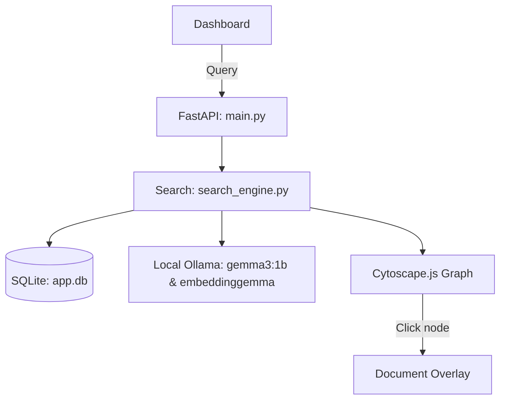

# ScribeLink: Local Document Query Engine & Citation Lineage

ScribeLink is a lightweight, local document query engine and decision-trail workspace running 100% offline. It integrates a **Cytoscape.js decision trail visualization**, **PageIndex page-bound chunking**, and a **hybrid BM25/Semantic search engine** using local embedding models.

---

## Technical Architecture



### Core Features
- **PageIndex Page-Aware Chunking & Citations:** Ingests PDFs page-by-page. Stores the raw text with a `page_number` key to cite exactly where info came from (e.g. `[1, Page 3]`).
- **Stabilized Physics Graph Visualizer:** Renders documents color-coded by department, connected by causal lineage relation edges (`followed_by` / user links) with hover details.
- **RRF Hybrid Search:** Merges Classical Keyword (SQLite FTS5 BM25) and Semantic vector similarity (NumPy cosine calculations) to find highly-relevant information.

---

## Local Setup

### 1. Pre-requisites & Local Models
Ensure you have [Ollama](https://ollama.com) installed and the required models loaded locally:
```bash
# Pull embedding and synthesis models
ollama pull embeddinggemma:latest
ollama pull gemma3:1b
```

### 2. Python Packages Installation
```bash
pip install fastapi uvicorn jinja2 python-multipart httpx rapidocr-onnxruntime pdfplumber pypdfium2 openpyxl python-docx python-pptx
```

### 3. Start the Server
```bash
python main.py
# Open http://localhost:8000
```

---

## High-Accuracy PP-OCRv5 Upgrade (Optional)
By default, the engine falls back to standard RapidOCR weights. For improved accuracy on low-quality scanned pages or multilingual text:

1. Create a directory: `models/ocr/` inside the server directory.
2. Download the PP-OCRv5 ONNX weights from Hugging Face:
   * **Detection model:** `det.onnx` from [monkt/paddleocr-onnx/detection/v5](https://huggingface.co/monkt/paddleocr-onnx)
   * **Recognition model & keys:** `rec.onnx` and `dict.txt` from [monkt/paddleocr-onnx/languages/english](https://huggingface.co/monkt/paddleocr-onnx)
3. Move files to:
   ```text
   models/ocr/det.onnx
   models/ocr/rec.onnx
   models/ocr/dict.txt
   ```
4. Restart the server. The engine will automatically detect and run the high-accuracy model suite.

---

## Offline Deployment Configuration
For deployment in strictly air-gapped workstations:
* Download the python wheels and models (`.gguf` / ONNX files) on an internet-connected computer and copy them onto your pen drive.
* Point the environment variables to your target paths on the offline machine.
* To run LiteParse's built-in Tesseract offline, set: `export TESSDATA_PREFIX=/path/to/tessdata_directory`.

