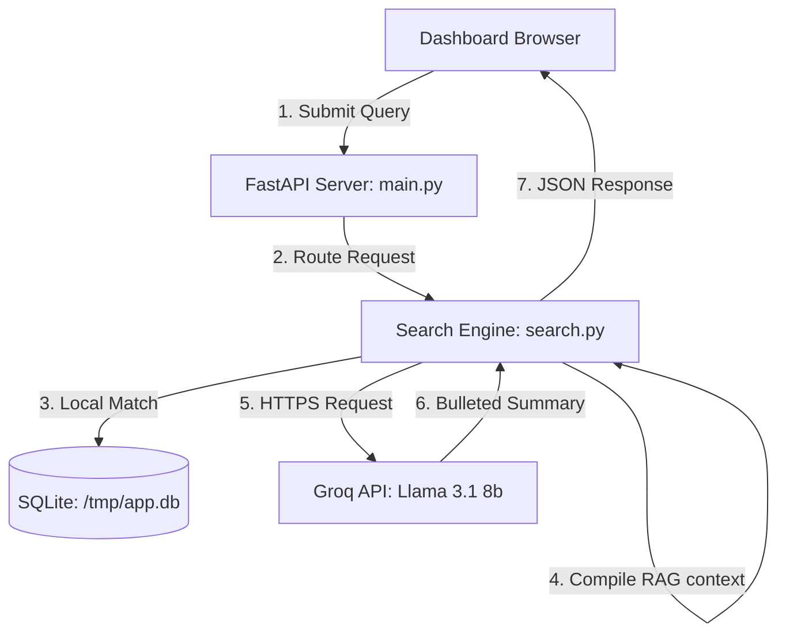

# ScribeLink: Hosted Demo Architecture & Setup

[Hosted Demo v1.0](https://em-bi-ts.vercel.app/)

ScribeLink is a lightweight, monochromatic, and modular document query engine. It implements a semantic search and RAG retrieval pipeline with D3-based lot lineage tracing.

Every code file in this repository is strictly kept **under 100 lines** for maximum readability.

---

## 🏛️ System Architecture



### Component Breakdown
* **Frontend**: Dark monochromatic layout utilizing native semantic HTML disclosures and Lucide SVG icons. A custom regex-based markdown parser renders bullet points, bold headers, and highlighted yes/no outcomes.
* **Serverless backend (FastAPI)**: Implements modular REST endpoints. On Vercel, the environment variable `VERCEL` is detected, copying the baseline database to `/tmp/app.db` to allow ephemeral writes in serverless functions.
* **RAG Retrieval Engine**: Combines tokenized keyword search with Lot ID boosting. Compiles context and queries the `llama-3.1-8b-instant` model on Groq Cloud using environment-stored `GROQ_API_KEY` credentials.

---

## ⚙️ Getting Started

### 1. Installation
Install production dependencies:
```bash
pip install fastapi uvicorn jinja2 python-multipart httpx
```

### 2. Environment Setup
To run search queries with live AI summaries, export your Groq key:
```bash
export GROQ_API_KEY="your_groq_api_key"
```
*(If unset, the engine automatically falls back to static mock answers).*

### 3. Running Locally
Start the FastAPI server:
```bash
python3 main.py
```
Open 👉 **http://127.0.0.1:8000** in your browser.

---

## 🧪 Verification
To run the automated endpoint validation suite:
```bash
python3 -m unittest verify_hosted.py
```
