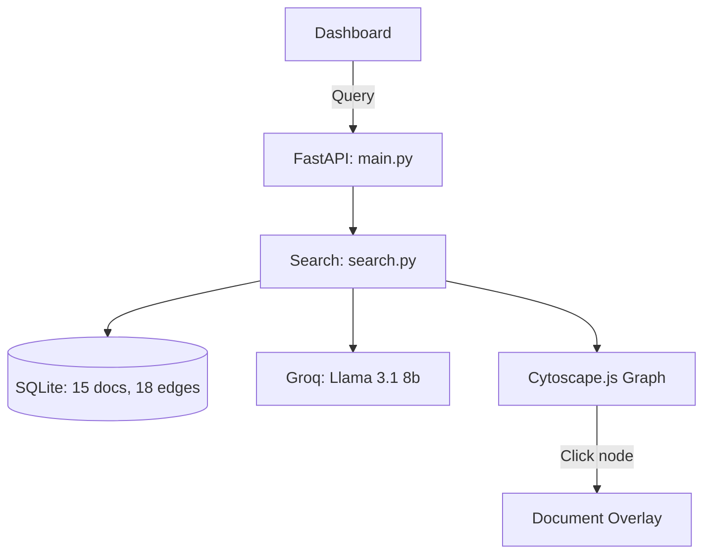

# ScribeLink: Hosted Demo with Graph & Citation Lineage

[Hosted Demo v1.2](https://em-bi-ts.vercel.app/)

ScribeLink is a lightweight, monochromatic, modular document query engine with **Cytoscape.js decision trail visualization** and **numbered citation tracking** — matching v3 feature parity.

Every code file in this repository is strictly kept **under 100 lines**.

---

## Architecture



### Key Additions (v1.2)
- **Cytoscape.js decision trail** — color-coded nodes by department, causal edges with rationale tooltips
- **Numbered citations [1], [2]** in source document cards
- **Lineage CRUD API** — create/delete edges with audit logging
- **15 semiconductor process documents** (from 7) — full Design→Fab→Excursion→Redesign lifecycle
- **18 lineage edges** with `followed_by` and `triggered_by` causal relations

---

## Setup

```bash
pip install fastapi uvicorn jinja2 python-multipart httpx
export GROQ_API_KEY="your_key"
python3 main.py
# Open http://127.0.0.1:8000
```

## Verification

```bash
python3 -m unittest verify_hosted.py
```
