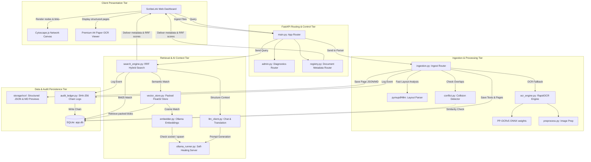

# ScribeLink: Local Document Query Engine & Citation Lineage

[](https://embits.onrender.com/)
[](https://embits.onrender.com/docs/system)

ScribeLink is a lightweight, local document query engine and decision-trail workspace designed to operate 100% offline in air-gapped environments. It integrates layout-aware text extraction, a stabilized physics graph visualizer, hybrid keyword/semantic search, and cryptographically chained activity auditing.

---

## 🏛️ Comprehensive Architecture

The following diagram illustrates the flow of queries, ingestions, and analytical operations through the system components:



---

## 🛠️ Micro-Architecture & Module Breakdown

### 1. Presentation & Interface (Frontend)
*   **Web Dashboard (`index.html` / `app.js`):** Built with pure CSS and vanilla Javascript using modern typography (`Outfit` & `Inter`). Operates as a single-page application with split resizing handles (`layout.js`). Includes search histories and realtime uploads (updates project dropdowns and registry lists instantly as soon as a single file completes ingestion).
*   **Cytoscape.js Visualizer (`static/js/graph.js`):** Instantiates an interactive network node graph mapping document connections. Nodes are color-coded by project/department, and edge connections (`followed_by` / `reference`) represent document lineages. Double-clicking any node opens the document viewer.
*   **Premium OCR Paper Viewer (`static/js/utils.js`):** A custom-designed, scrollable A4-style document preview container. It renders parsed markdown in high-contrast charcoal text over a white paper sheet, styling nested headers, quoted blocks, bullet lists, and borders on markdown tables. Includes an intelligent search highlight marker to keep matched words legible.

### 2. Control & Routing Layer (FastAPI)
*   **`main.py`:** Initializes the FastAPI framework, configures route integrations, sets up directory mounts for static previews, and exposes core endpoints such as `/api/search` and `/api/upload`.
*   **`registry.py` & `admin.py`:** Handles administrative views, metadata modifications, project categorization updates, and database diagnostic logs.

### 3. Document Ingestion & Optical Parsing
*   **`ingestion.py`:** Routes files by extension. Directly extracts raw structural paragraphs and tabular grids from text-based office formats (`.docx`, `.xlsx`, `.pptx`, `.txt`, `.csv`, `.md`).
*   **`ocr_engine.py`:** Uses `pymupdf4llm` as the highest-priority engine to run layout analysis, multi-column reading order reconstruction, and native table detection on PDFs. Falls back to a local `RapidOCR` instance on scanned pages.
*   **`preprocess.py`:** Pre-processes image frames (rescale, grayscale, thresholding, skew alignment) before sending to OCR to improve text recognition accuracy.
*   **`conflict.py`:** Compares newly uploaded text chunks against existing database records to flag potential data duplication or semantic overlap before database insertion.

### 4. RRF Retrieval & Vector Space
*   **`search_engine.py`:** Implements Reciprocal Rank Fusion (RRF). Executes parallel keyword search (using SQLite FTS5 BM25 scoring) and dense semantic vector search, fusing their ranks to deliver precise citations.
*   **`vector_store.py`:** Packs 768-dimensional float32 vectors generated by the embedding model into compact SQLite database binary BLOBs using python's `struct` library, calculating cosine similarity on-the-fly.
*   **`ollama_runner.py`:** A self-healing manager. Validates local socket availability (`http://localhost:11434`) and programmatically starts the Ollama server in a background thread if it is stopped, ensuring reliability.

### 5. Cryptographic Auditing & Logging
*   **`audit_ledger.py`:** Chains query history and file uploads into a secure SHA-256 block ledger stored in the SQLite database, validating the block hash sequence to detect unauthorized database tampering.

---

## 💾 SQLite Database Schemas

The database contains two core tables that track documents, page structures, and vector indices:

### 1. `meetings` (Document Level)
| Column | Type | Description |
| :--- | :--- | :--- |
| `id` | TEXT (PK) | Unique document ID hash |
| `title` | TEXT | Display filename or custom title |
| `date` | TEXT | Document date (YYYY-MM-DD) |
| `lot_id` | TEXT | Lot assignment key |
| `project_id` | TEXT | Category / Project folder key |
| `file_path` | TEXT | Static relative filesystem location |
| `file_size_bytes` | INTEGER | File size on disk |
| `transcript_text` | TEXT | Raw extracted plain text |
| `source_type` | TEXT | File extension |
| `content_hash` | TEXT | SHA-256 payload checksum |
| `ocr_engine` | TEXT | Parsing tool used (e.g. `pymupdf4llm`, `rapidocr`) |
| `page_count` | INTEGER | Page length of the document |

### 2. `chunks` (Page Level Passage Index)
| Column | Type | Description |
| :--- | :--- | :--- |
| `id` | TEXT (PK) | Unique chunk ID (`{doc_id}-{index}`) |
| `meeting_id` | TEXT (FK) | Reference key mapping to `meetings.id` |
| `chunk_index` | INTEGER | Chronological index of passage |
| `chunk_text` | TEXT | Segment text string |
| `page_number` | INTEGER | Physical document page number |

---

## 🚀 Local Quickstart

### 1. Pre-requisites & Local Models
Ensure you have [Ollama](https://ollama.com) installed and the models loaded:
```bash
ollama pull embeddinggemma:latest
ollama pull gemma3:1b
```

### 2. Installation
Install Python packages:
```bash
pip install -r requirements.txt
```

### 3. Run ScribeLink
```bash
python main.py
```
Open **`http://localhost:8000`** in your browser.

---

## 📦 Offline Deployment (Air-Gapped Setup)

To deploy on air-gapped RHEL / Windows workstations:
1. Download all required Python wheel files and the repository zip on an internet-connected machine.
2. Download model files (`embeddinggemma` / `gemma3:1b`) and ONNX OCR weights.
3. Transfer files via a secure USB drive (offline bundle).
4. Run the offline installation script included in the bundle to set up ScribeLink locally.
